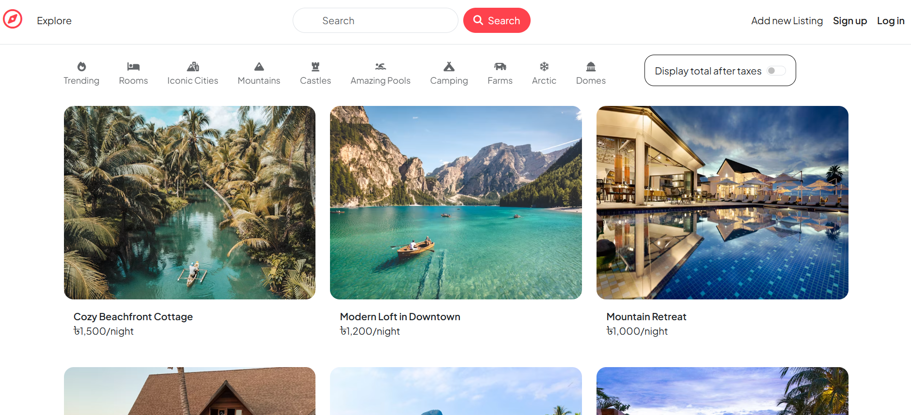
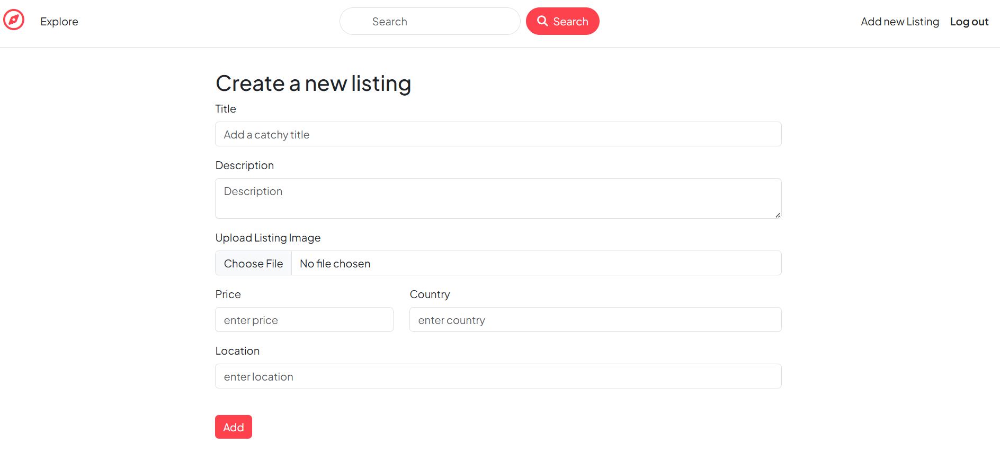
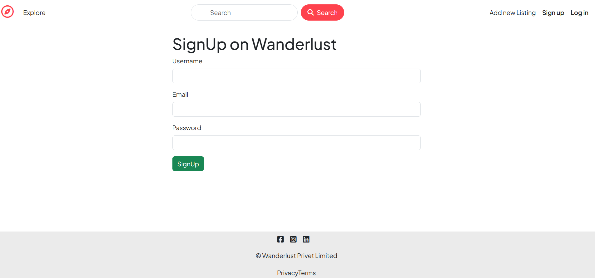
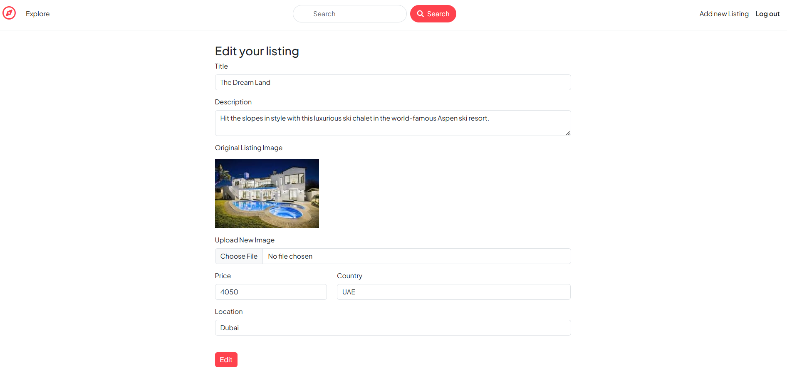
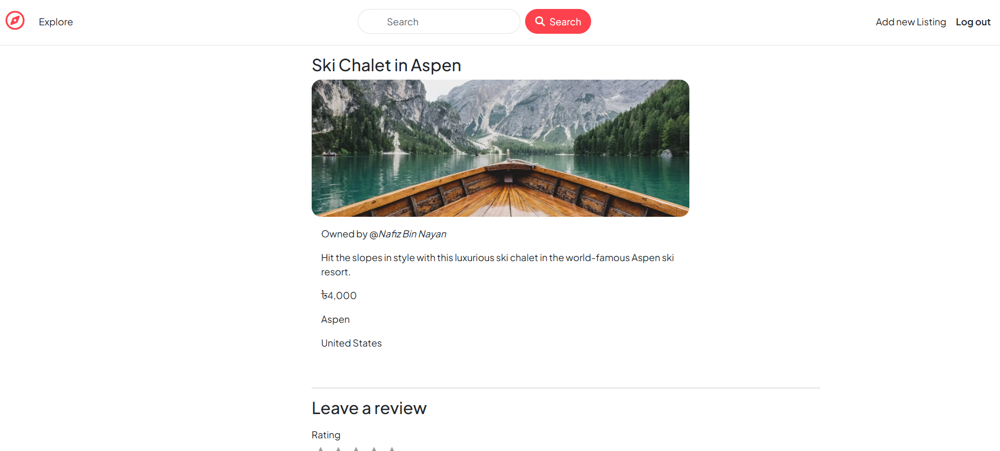
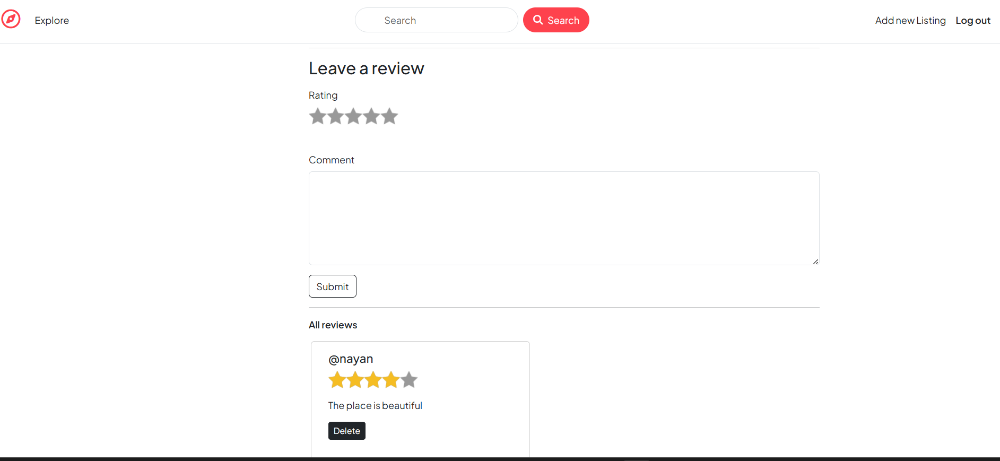

# 🏠 WonderLust — Airbnb Clone (MERN Stack)

WonderLust is a full-stack web application inspired by **Airbnb**, built using the **MERN stack (MongoDB, Express.js, Node.js, and EJS)**.  
It allows users to **list, explore, and book rental properties** — replicating the core functionality of Airbnb in a simplified form.

---

## 🚀 Features

- 🔐 **User Authentication** – Users can sign up, log in, and manage their listings.
- 🏡 **Property Listings** – Hosts can add, edit, and remove their listings.
- 💬 **Reviews & Ratings** – Users can leave reviews and ratings for properties.
- 📱 **Responsive Design** – Works smoothly on both mobile and desktop devices.
- 🗺️ **Map Integration (Optional)** – Displays listings on an interactive map.
- 🖼️ **Image Uploads** – Hosts can upload images while listing properties.
- ⚙️ **Secure Authorization** – Protected routes using Passport.js.

---

## 🛠️ Tech Stack

| Category           | Technology                    |
| ------------------ | ----------------------------- |
| **Frontend**       | EJS Templates                 |
| **Backend**        | Node.js, Express.js           |
| **Database**       | MongoDB (Mongoose ODM)        |
| **Styling**        | CSS3, Bootstrap, Tailwind CSS |
| **Authentication** | Passport.js                   |
| **Deployment**     | Render / Vercel               |

---

## 📸 Screenshots

### 🏠 Home Page

### 🏡 Property Listing

### 🔐 Sign up Page

### 🔐 Edit Listing

### 🔐 View a Listing

### 🔐 Add Review

---
